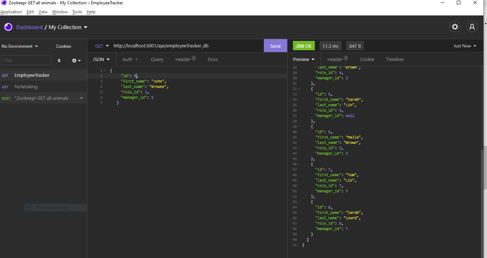
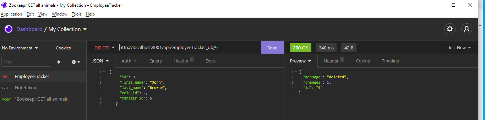
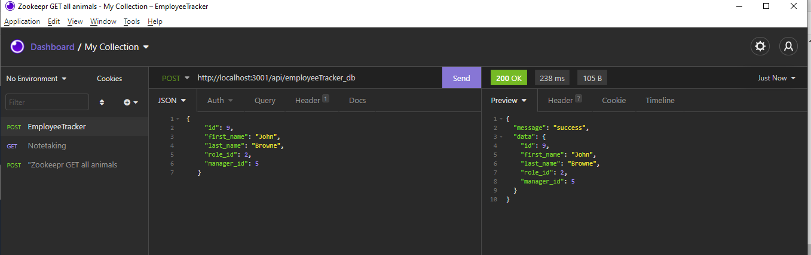

# Employee-Tracker
# User Story
AS A business owner
I WANT to be able to view and manage the departments, roles, and employees in my company
SO THAT I can organize and plan my business
# Acceptance Criteria
GIVEN a command-line application that accepts user input
WHEN I start the application
THEN I am presented with the following options: view all departments, view all roles, view all employees, add a department, add a role, add an employee, and update an employee role
WHEN I choose to view all departments
THEN I am presented with a formatted table showing department names and department ids
WHEN I choose to view all roles
THEN I am presented with the job title, role id, the department that role belongs to, and the salary for that role
WHEN I choose to view all employees
THEN I am presented with a formatted table showing employee data, including employee ids, first names, last names, job titles, departments, salaries, and managers that the employees report to
WHEN I choose to add a department
THEN I am prompted to enter the name of the department and that department is added to the database
WHEN I choose to add a role
THEN I am prompted to enter the name, salary, and department for the role and that role is added to the database
WHEN I choose to add an employee
THEN I am prompted to enter the employee’s first name, last name, role, and manager and that employee is added to the database
WHEN I choose to update an employee role
THEN I am prompted to select an employee to update and their new role and this information is updated in the database 
# Mock-Up

# Getting Started
Use the MySQL2 package to connect to your MySQL database and perform queries
 Inquirer package to interact with the user via the command-line
 the console.table package to print MySQL rows to the console.
# Schema Design

# Criteria
# Department
    * id
    * name
# Role
    * id
    * title
    * salary
    * department_id
# Employee
    * id
    * first_name
    * last_name
    * role_id
    * manager_id
# Bonus
    * Update employee managers
    * View employees by manager
    * View employees by department
    * Delete departments, roles, and employees
    * View the total utilized budget of a department 
        -- ie the combined salaries of all employees in that department
# Results Experimenting with Insomnia

# Final Project
# Video Walk Through

# Challenges
Displaying Database Tables 

# Github Respository
[Repository](https://github.com/Jahneo/Employee-Tracker)

#### [Jahneo@aim.com](mailto:Jahneo@aim.com)
  [Github link](https://github.com/Jahneo) 

